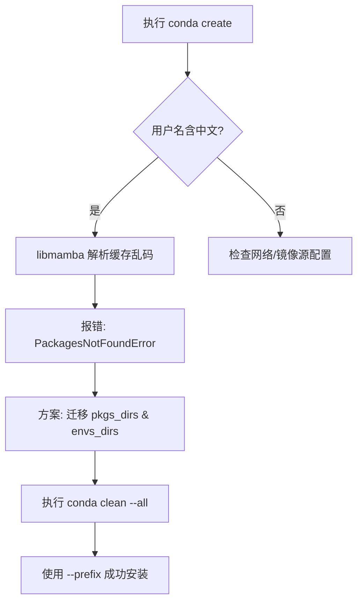

# Conda 环境创建失败(Windows 路径编码专项)

项目在配置开发环境时，若遇到 Python 版本或者其他开发工具的版本无法识别，通常会出现这种报错信息 `PackagesNotFoundError`，通常是由 **Windows 中文用户名** 导致的路径编码冲突引起的。

---

## 问题背景

在 Windows 系统下，如果用户名为中文（如 `C:\Users\张三`），Conda 最新的 `libmamba` 解析器在读取本地缓存的中文索引时会产生乱码（如 `寮犱笢闃`），导致其无法正确匹配已存在的安装包。

---

## 核心修复流程

### 1. 环境检查

首先确认 Conda 能够联网搜索到目标包：这里以python3.12版本为例

```bash

conda search python=3.12

```

若有结果输出但 create 失败，即可确认是本地路径/解析器问题。
如果没有结果输出，或者有报错，那可能就是你的数据源有问题。
### 2. 路径重定向（解决乱码根源）

将 Conda 的缓存和环境目录迁移至 D 盘（或任意全英文路径）。

```bash

# 1. 设置包缓存目录

conda config --add pkgs_dirs D:\conda_data\pkgs

# 2. 设置虚拟环境存放目录

conda config --add envs_dirs D:\conda_data\envs

# 3. 彻底清理旧的受损索引缓存（必须执行）

conda clean --all -y
```

### 3. 初始化环境

使用 --prefix 参数强制指定物理路径，确保避开 C 盘用户目录：

```bash

conda create --prefix D:\conda_data\envs\py12 python=3.12 -y

```

---

## 修复逻辑图示



---


## ✅ 验证激活

安装完成后，通过以下方式验证环境：

1. 激活环境：
    
    ```bash
    
    # 若已配置 envs_dirs，可简写：
    
    conda activate py12
    
    # 或者使用全路径：
    
    conda activate D:\conda_data\envs\py12
    
    ```
    
2. 确认版本：
    
    ```bash
    
    python --version # 应输出 Python 3.12.x
    
    ```
    

## 长期建议

- **全英文路径**：相比大多数人都有这种感觉，看到路径里有中文就总有一种不详的预感，我与乱码不共戴天。
