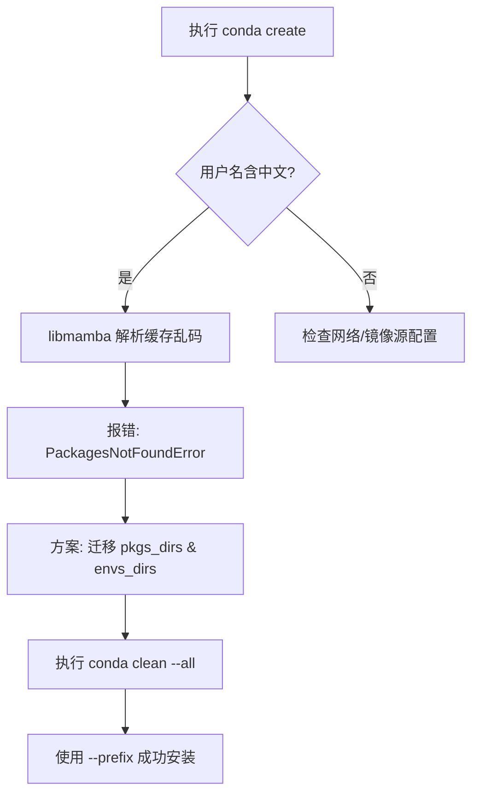

# 🛠️ Conda 环境创建失败修复指南 (Windows 路径编码专项)

本项目在配置开发环境时，若遇到 Python 版本无法识别或 `PackagesNotFoundError`，通常是由 **Windows 中文用户名** 导致的路径编码冲突引起的。

---

## 📖 问题背景

在 Windows 系统下，如果用户名为中文（如 `C:\Users\张东阳`），Conda 最新的 `libmamba` 解析器在读取本地缓存索引时会产生乱码（如 `寮犱笢闃`），导致其无法正确匹配已存在的安装包。

---

## 🚀 核心修复流程

### 1. 环境自检

首先确认 Conda 能够联网搜索到目标包：

```bash

conda search python=3.12

```

若有结果输出但 create 失败，即可确认是本地路径/解析器问题。

### 2. 路径重定向（解决乱码根源）

将 Conda 的缓存和环境目录迁移至 D 盘（或任意全英文路径）。

```bash

# 1. 设置包缓存目录

conda config --add pkgs_dirs D:\conda_data\pkgs

# 2. 设置虚拟环境存放目录

conda config --add envs_dirs D:\conda_data\envs

# 3. 彻底清理旧的受损索引缓存（必须执行）

conda clean --all -y

```

### 3. 初始化环境

使用 --prefix 参数强制指定物理路径，确保避开 C 盘用户目录：

```bash

conda create --prefix D:\conda_data\envs\py12 python=3.12 -y

```

---

## 📊 修复逻辑图示



---

## 🛠️ 进阶调试方案 (备选)

|**方案**|**命令**|**适用场景**|
|---|---|---|
|**切换解析器**|`--solver=classic`|新版 libmamba 依然报错时|
|**禁用 SSL**|`conda config --set ssl_verify false`|公司内网或代理拦截时|

---

## ✅ 验证与激活

安装完成后，通过以下方式验证环境：

1. 激活环境：
    
    ```bash
    
    # 若已配置 envs_dirs，可简写：
    
    conda activate py12
    
    # 或者使用全路径：
    
    conda activate D:\conda_data\envs\py12
    
    ```
    
2. 确认版本：
    
    ```bash
    
    python --version # 应输出 Python 3.12.x
    
    ```
    

## ⚠️ 长期建议

- **全英文路径**：建议项目源码也存放在非中文路径（如 `D:\Projects\...`）。
    
- **IDE 配置**：在 PyCharm 或 VS Code 中选择解释器时，手动指向 `D:\conda_data\envs\py12\python.exe`。